# Design Document: Quantum-Assisted AI Interview Intelligence and Placement Readiness Platform

## Overview
 
The Quantum-Assisted AI Interview Intelligence and Placement Readiness Platform is a comprehensive, student-centric system that helps individual students prepare for technical and HR interviews before college placement drives. Each student receives a personalised interview experience — adaptive multi-turn AI interviews, live coding assessments, speech and behavioural analysis, and quantum-optimised preparation paths — all evaluated independently against their own resume, skills, projects, and target roles. The platform does not rank or compare students; every analysis, score, and recommendation is scoped to the individual.

The system is built on a React + TypeScript frontend, a Django backend for user and data management, a FastAPI AI-service for real-time AI/ML inference, PostgreSQL for persistent storage, Redis for caching and async task queuing, and Qiskit/QAOA for quantum-optimised interview preparation scheduling and topic weighting. Docker and Nginx handle deployment.

---

## 1. High-Level System Architecture

### 1.1 Conceptual Block Diagram

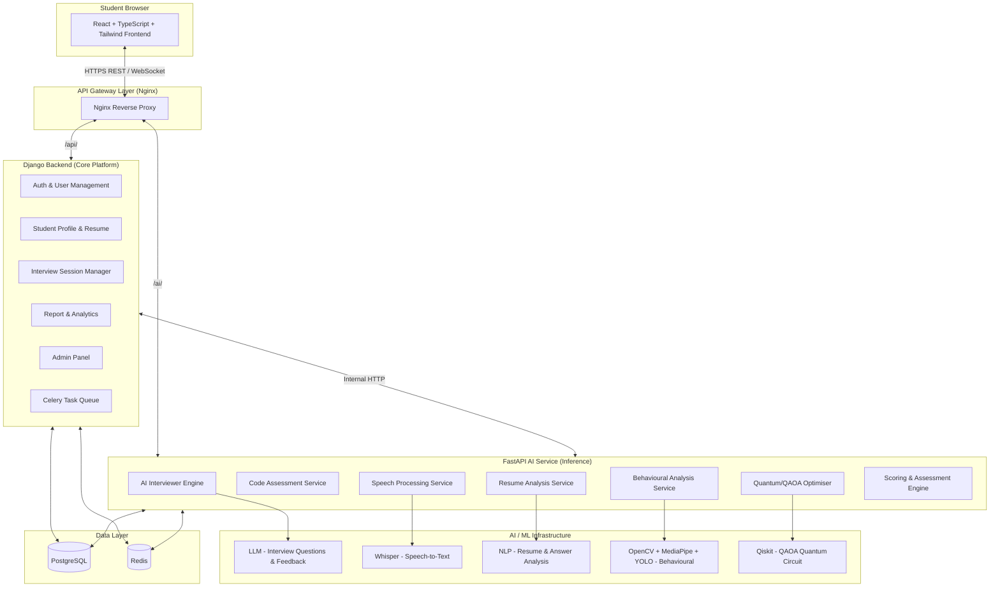

### 1.2 Service Responsibility Matrix

| Concern | Django | FastAPI |
|---|---|---|
| User registration, login, JWT auth | ✅ | — |
| Student profile & resume upload | ✅ | — |
| Interview session lifecycle | ✅ | — |
| Report storage & retrieval | ✅ | — |
| Admin dashboard | ✅ | — |
| Background task orchestration | ✅ (Celery) | — |
| AI interview turn generation | — | ✅ |
| Code execution & evaluation | — | ✅ |
| Speech-to-text transcription | — | ✅ |
| Behavioural analysis (video) | — | ✅ |
| Resume parsing & skill extraction | — | ✅ |
| QAOA quantum optimisation | — | ✅ |
| Per-turn scoring & feedback | — | ✅ |


---

## 2. Frontend Architecture (React + TypeScript + Tailwind CSS)

### 2.1 Component Hierarchy

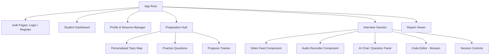

### 2.2 Frontend Modules

| Module | Purpose | Key Libraries |
|---|---|---|
| Auth | Registration, login, JWT storage | React Hook Form, Axios |
| Dashboard | Student's home: sessions, scores, tips | Recharts |
| Profile / Resume | Upload resume, set target role, skills | React Dropzone |
| Preparation Hub | Quantum-optimised topic plan, practice | Custom components |
| Interview Session | Live AI interview: video, audio, code | Monaco Editor, MediaRecorder API |
| Report Viewer | Post-interview report with per-area feedback | Recharts, PDF export |

### 2.3 Communication Pattern

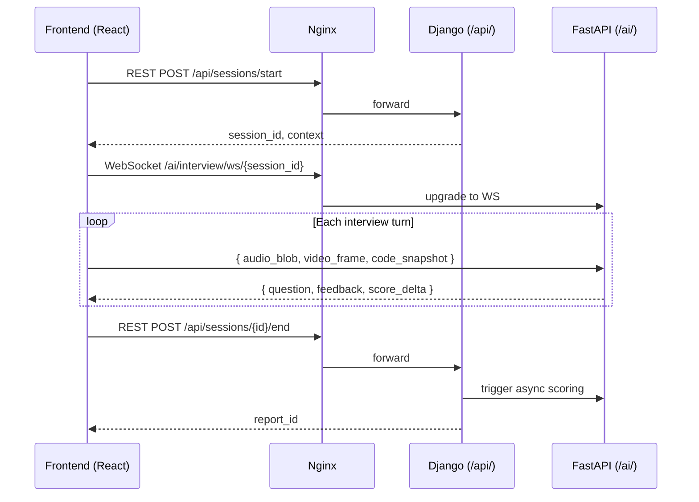

### 2.4 State Management

- **Zustand** for global student/session state.
- **React Query** for all REST data fetching, caching, and invalidation.
- **WebSocket context** for real-time interview stream.

### 2.5 Key Design Decisions

- Monaco Editor is embedded for coding assessments; output is streamed back over the same WebSocket.
- Video frames are captured via `getUserMedia`, downsampled, and sent as base64 or binary blobs.
- Audio chunks are sent via MediaRecorder in opus/webm format to the Whisper service.
- JWT is stored in `httpOnly` cookies to mitigate XSS.


---

## 3. Django Backend Architecture

### 3.1 Django Apps

```
backend/
├── config/               # settings, urls, wsgi, asgi
├── apps/
│   ├── accounts/         # User, StudentProfile models + auth views
│   ├── resumes/          # Resume upload, storage, metadata
│   ├── sessions/         # InterviewSession lifecycle
│   ├── reports/          # Report storage, retrieval
│   ├── admin_panel/      # Django admin customisation
│   └── notifications/    # Email / in-app notification triggers
├── core/                 # Shared utilities, base models, permissions
├── tasks/                # Celery task definitions
└── integrations/         # HTTP clients to FastAPI AI service
```

### 3.2 Data Flow Through Django

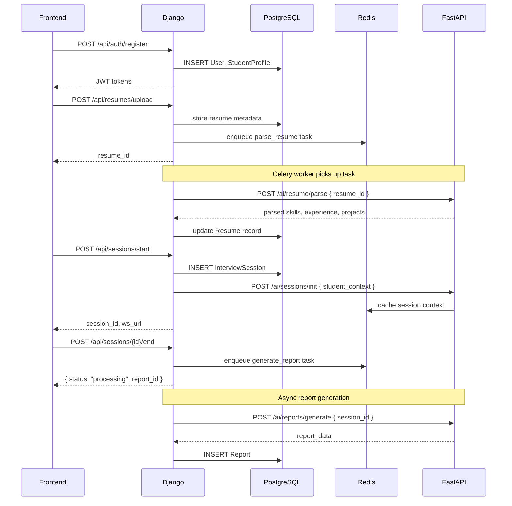

### 3.3 Asynchronous Tasks (Celery + Redis)

| Task | Trigger | Queue |
|---|---|---|
| `parse_resume` | Resume upload | `resume_queue` |
| `init_quantum_plan` | After resume parsed | `quantum_queue` |
| `generate_report` | Session end | `report_queue` |
| `send_notification` | Report ready | `notification_queue` |

### 3.4 Django Models (Conceptual)

```typescript
// Expressed as TypeScript-style interfaces for clarity
interface User {
  id: UUID
  email: string
  password_hash: string
  is_active: boolean
  created_at: datetime
}

interface StudentProfile {
  id: UUID
  user: FK<User>
  full_name: string
  college: string
  graduation_year: number
  target_roles: string[]
  skills: string[]
}

interface Resume {
  id: UUID
  student: FK<StudentProfile>
  file_path: string
  parsed_data: JSONB          // skills, projects, experience
  parsed_at: datetime | null
  version: number
}

interface InterviewSession {
  id: UUID
  student: FK<StudentProfile>
  session_type: "technical" | "hr" | "mixed"
  target_role: string
  status: "created" | "active" | "completed" | "aborted"
  started_at: datetime
  ended_at: datetime | null
  quantum_plan_id: UUID | null
}

interface Report {
  id: UUID
  session: FK<InterviewSession>
  overall_score: float
  technical_score: float
  communication_score: float
  behavioural_score: float
  coding_score: float
  detailed_feedback: JSONB
  improvement_areas: string[]
  generated_at: datetime
}
```


---

## 4. FastAPI AI Service Architecture

### 4.1 Router Structure

```
ai_service/
├── main.py                   # FastAPI app, lifespan, CORS
├── routers/
│   ├── interview.py          # /ai/interview/* (WS + REST)
│   ├── code_assessment.py    # /ai/code/*
│   ├── speech.py             # /ai/speech/*
│   ├── behaviour.py          # /ai/behaviour/*
│   ├── resume.py             # /ai/resume/*
│   ├── quantum.py            # /ai/quantum/*
│   ├── scoring.py            # /ai/scoring/*
│   └── reports.py            # /ai/reports/*
├── services/
│   ├── llm_service.py        # LLM prompt construction & inference
│   ├── whisper_service.py    # Audio transcription
│   ├── nlp_service.py        # NLP analysis
│   ├── vision_service.py     # OpenCV / MediaPipe / YOLO
│   ├── code_runner.py        # Sandboxed code execution
│   ├── qaoa_service.py       # Qiskit circuit + optimisation
│   └── scoring_service.py    # Multi-dimensional scoring
├── models/                   # Pydantic request/response models
├── core/
│   ├── redis_client.py
│   ├── db.py                 # SQLAlchemy async session
│   └── security.py           # Verify JWT from Django
└── workers/                  # Background async tasks (asyncio)
```

### 4.2 Async Design

All I/O-bound operations in FastAPI use `async def`. CPU-bound inference (model forward passes) run in a `ProcessPoolExecutor` to avoid blocking the event loop.

| Endpoint | Async? | Reason |
|---|---|---|
| WS /ai/interview/ws | Yes | Real-time streaming |
| POST /ai/resume/parse | Yes | LLM + NLP I/O |
| POST /ai/code/execute | Yes | Subprocess I/O |
| POST /ai/speech/transcribe | Yes | Whisper model I/O |
| POST /ai/behaviour/analyse | ProcessPool | OpenCV CPU-bound |
| POST /ai/quantum/optimise | ProcessPool | Qiskit circuit CPU-bound |
| POST /ai/reports/generate | Yes | Aggregation + LLM |

### 4.3 Session Context in Redis

When a session starts, FastAPI writes a session context blob to Redis with TTL = session timeout.

```typescript
interface SessionContext {
  session_id: string
  student_id: string
  target_role: string
  resume_summary: ResumeSummary
  quantum_topic_weights: Record<string, number>
  turn_history: InterviewTurn[]
  current_phase: "warmup" | "technical" | "coding" | "hr" | "closing"
  turn_count: number
}
```

Each WebSocket message reads and updates this context atomically using Redis WATCH/MULTI/EXEC.


---

## 5. PostgreSQL Database Architecture

### 5.1 Schema Diagram

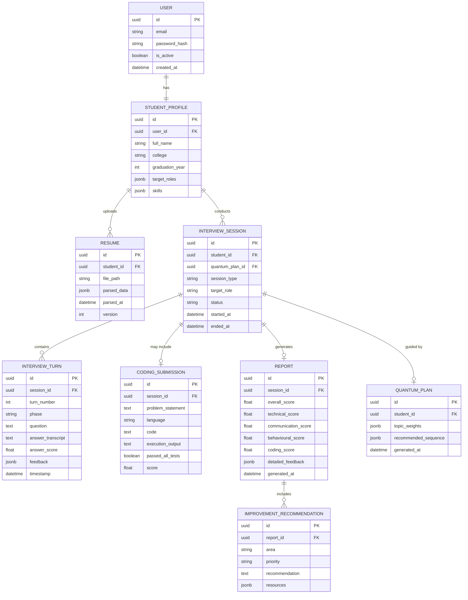

### 5.2 Indexing Strategy

| Table | Index | Reason |
|---|---|---|
| `interview_session` | `(student_id, status)` | Filter active sessions per student |
| `interview_turn` | `(session_id, turn_number)` | Sequential turn retrieval |
| `report` | `(session_id)` | Fast report lookup |
| `resume` | `(student_id, version DESC)` | Latest resume per student |
| `quantum_plan` | `(student_id, generated_at DESC)` | Latest plan per student |


---

## 6. Redis Usage

Redis serves four distinct purposes across the platform:

### 6.1 Celery Broker & Result Backend (Django)

Django Celery uses Redis as the message broker. Task results are stored with a 24-hour TTL.

```
Queues:
  resume_queue       → parse_resume tasks
  quantum_queue      → init_quantum_plan tasks
  report_queue       → generate_report tasks
  notification_queue → send_notification tasks
```

### 6.2 Live Session Context Store (FastAPI)

During an active interview WebSocket session, the full `SessionContext` object is stored in Redis to allow stateless FastAPI workers to serve any WebSocket message.

```
Key pattern:   session:context:{session_id}
TTL:           4 hours (max interview duration)
Serialisation: MessagePack (compact binary)
Concurrency:   WATCH/MULTI/EXEC for optimistic locking
```

### 6.3 Response Caching (FastAPI)

Slow, deterministic operations are cached in Redis to avoid redundant computation:

| Cache Key | Content | TTL |
|---|---|---|
| `resume:parsed:{resume_id}` | Parsed resume JSON | 24 h |
| `quantum:plan:{student_id}` | QAOA topic weights | 12 h |
| `llm:questions:{role}:{topic}` | Generated questions per topic | 1 h |

### 6.4 Rate Limiting

Redis counters enforce per-student rate limits on expensive operations (code execution, LLM calls):

```
Key pattern:   ratelimit:{student_id}:{operation}:{minute_bucket}
TTL:           60 seconds
Max:           10 code executions/min, 30 LLM calls/min per student
```


---

## 7. Resume Analysis Architecture

### 7.1 Pipeline

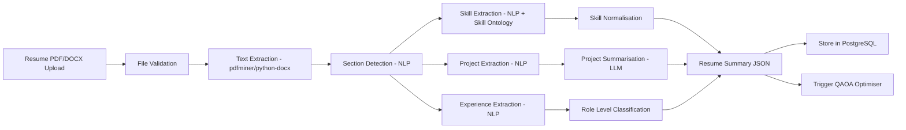

### 7.2 Key Functions

```typescript
// Router: POST /ai/resume/parse
interface ParseResumeRequest {
  resume_id: string
  file_path: string
}

interface ResumeSummary {
  skills: Skill[]
  projects: Project[]
  experience: ExperienceEntry[]
  education: EducationEntry[]
  inferred_level: "fresher" | "junior" | "mid"
  raw_text_tokens: number
}

interface Skill {
  name: string
  category: "language" | "framework" | "tool" | "concept" | "soft"
  confidence: float          // 0.0 – 1.0 from NLP extraction
  years_mentioned: number | null
}

interface Project {
  title: string
  tech_stack: string[]
  summary: string            // LLM-generated 2-sentence summary
  complexity_score: float    // 0.0 – 1.0
}
```

### 7.3 Algorithm: Skill Extraction

```pascal
PROCEDURE extract_skills(resume_text)
  INPUT: resume_text (String)
  OUTPUT: skills (List of Skill)

  SEQUENCE
    tokens ← nlp_tokenise(resume_text)
    skill_candidates ← []

    FOR each span IN ner_model.predict(tokens) DO
      IF span.label IN ["TECH", "FRAMEWORK", "LANGUAGE"] THEN
        normalised ← skill_ontology.normalise(span.text)
        confidence ← span.score
        skill_candidates.append({ name: normalised, confidence: confidence })
      END IF
    END FOR

    // Deduplicate keeping highest confidence per skill name
    skills ← deduplicate_by_max_confidence(skill_candidates)

    RETURN skills
  END SEQUENCE
END PROCEDURE
```


---

## 8. AI Interviewer Architecture

### 8.1 Overview

The AI Interviewer is a multi-turn conversational engine running over WebSocket. It drives the interview through five phases, dynamically adapts questions based on prior answers, and evaluates each response before generating the next question.

### 8.2 Interview Phase State Machine

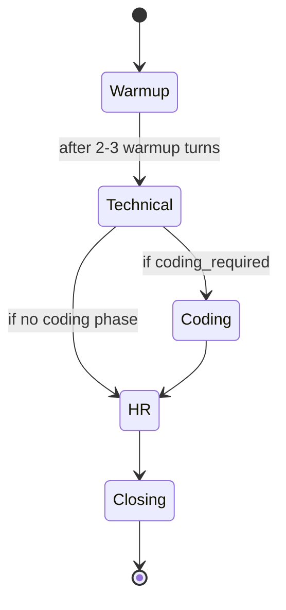

### 8.3 WebSocket Message Schema

```typescript
// Client → Server
interface ClientMessage {
  type: "audio_chunk" | "video_frame" | "code_snapshot" | "text_answer" | "control"
  session_id: string
  payload: string        // base64-encoded binary or JSON string
  sequence_num: number
}

// Server → Client
interface ServerMessage {
  type: "question" | "feedback" | "phase_change" | "session_end" | "error"
  turn_number: number
  question?: string             // TTS-ready text
  question_audio?: string       // base64 TTS audio (optional)
  live_feedback?: string        // brief real-time comment
  phase?: InterviewPhase
  error?: string
}
```

### 8.4 Algorithm: Adaptive Question Generation

```pascal
PROCEDURE generate_next_question(session_context, last_answer_analysis)
  INPUT: session_context (SessionContext), last_answer_analysis (AnswerAnalysis)
  OUTPUT: next_question (String), updated_context (SessionContext)

  SEQUENCE
    current_phase ← session_context.current_phase
    topic_weights ← session_context.quantum_topic_weights
    turn_history  ← session_context.turn_history

    // Determine weakest topic in current phase
    covered_topics ← extract_topics(turn_history)
    weak_topic ← select_weakest_topic(topic_weights, covered_topics, last_answer_analysis.score)

    // Build LLM prompt
    prompt ← build_prompt(
      phase        = current_phase,
      target_role  = session_context.target_role,
      topic        = weak_topic,
      resume       = session_context.resume_summary,
      history      = last_N_turns(turn_history, N=5),
      answer_score = last_answer_analysis.score
    )

    // Adaptive difficulty
    IF last_answer_analysis.score >= 0.8 THEN
      prompt.difficulty ← "harder"
    ELSE IF last_answer_analysis.score <= 0.4 THEN
      prompt.difficulty ← "easier"
    ELSE
      prompt.difficulty ← "same"
    END IF

    question ← llm_service.generate(prompt)

    // Update context
    session_context.turn_count ← session_context.turn_count + 1
    IF should_advance_phase(session_context) THEN
      session_context.current_phase ← next_phase(current_phase)
    END IF

    RETURN question, session_context
  END SEQUENCE
END PROCEDURE
```

### 8.5 LLM Prompt Structure

The prompt sent to the LLM is a structured template:

```
System: You are a senior {target_role} interviewer at a top tech company.
        You are interviewing {student_name} who has skills in {skills}.
        Ask ONE focused question about {topic} at {difficulty} level.
        Do NOT reveal the expected answer. Do NOT ask multi-part questions.

Context: Recent turns: {last_5_turns}
         Student's resume highlights: {resume_summary}

Instruction: Generate the next interview question for phase: {phase}.
```


---

## 9. Coding Assessment Architecture

### 9.1 Overview

During the coding phase of a technical interview, the student is presented with a problem in Monaco Editor, writes code, runs it, and submits. The AI evaluator assesses correctness, efficiency, and code quality.

### 9.2 Supported Languages

Python 3.11, JavaScript (Node 20), Java 21, C++17, Go 1.22

### 9.3 Code Execution Pipeline

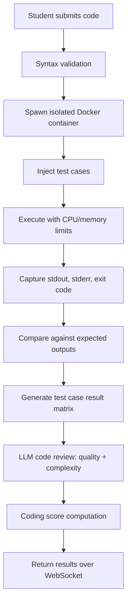

### 9.4 Security Model

- Each execution runs in a `docker run --rm --network none --memory 256m --cpus 1` container.
- No filesystem write access outside `/tmp`.
- Hard timeout: 10 seconds per execution.
- Code is inspected for forbidden syscalls before execution.

### 9.5 Key Functions

```typescript
interface CodeSubmission {
  session_id: string
  problem_id: string
  language: "python" | "javascript" | "java" | "cpp" | "go"
  code: string
}

interface CodeExecutionResult {
  test_results: TestCaseResult[]
  passed_count: number
  total_count: number
  runtime_ms: number
  memory_kb: number
  stdout: string
  stderr: string
  timed_out: boolean
}

interface TestCaseResult {
  test_id: string
  input: string
  expected_output: string
  actual_output: string
  passed: boolean
}

interface CodeAssessment {
  execution_result: CodeExecutionResult
  correctness_score: float     // % test cases passed
  efficiency_score: float      // based on runtime + memory vs benchmark
  quality_score: float         // LLM code review: style, edge cases, comments
  overall_coding_score: float  // weighted average
  llm_review: string           // textual feedback
}
```

### 9.6 Algorithm: Code Assessment Scoring

```pascal
PROCEDURE assess_code(submission, execution_result, problem_metadata)
  INPUT: submission (CodeSubmission),
         execution_result (CodeExecutionResult),
         problem_metadata (ProblemMetadata)
  OUTPUT: assessment (CodeAssessment)

  SEQUENCE
    // Correctness
    correctness ← execution_result.passed_count / execution_result.total_count

    // Efficiency: compare against median runtime for this problem
    IF execution_result.timed_out THEN
      efficiency ← 0.0
    ELSE
      normalised_runtime ← execution_result.runtime_ms / problem_metadata.median_runtime_ms
      efficiency ← clamp(2.0 - normalised_runtime, 0.0, 1.0)
    END IF

    // Quality: LLM review
    review_prompt ← build_code_review_prompt(submission.code, submission.language,
                                              problem_metadata.description)
    llm_response  ← llm_service.review_code(review_prompt)
    quality       ← llm_response.quality_score   // 0.0 – 1.0

    // Weighted overall
    overall ← (0.5 * correctness) + (0.25 * efficiency) + (0.25 * quality)

    RETURN CodeAssessment {
      correctness_score = correctness,
      efficiency_score  = efficiency,
      quality_score     = quality,
      overall_coding_score = overall,
      llm_review        = llm_response.review_text
    }
  END SEQUENCE
END PROCEDURE
```


---

## 10. Speech Processing Architecture

### 10.1 Pipeline

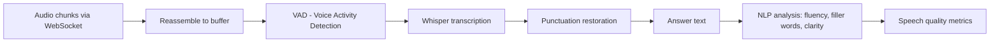

### 10.2 Data Formats

- Audio format: WebM/Opus, chunks of ~500ms.
- Whisper model: `whisper-large-v3` (hosted locally or via API).
- VAD: Silero VAD to discard silence.

### 10.3 Key Functions

```typescript
// POST /ai/speech/transcribe
interface TranscribeRequest {
  session_id: string
  audio_b64: string          // base64 webm/opus
  language_hint: string      // e.g. "en"
}

interface TranscribeResponse {
  transcript: string
  confidence: float
  duration_seconds: float
  detected_language: string
}

interface SpeechQualityMetrics {
  words_per_minute: float
  filler_word_ratio: float       // "um", "uh", "like" / total words
  avg_pause_duration_ms: float
  clarity_score: float           // 0.0 – 1.0
  fluency_score: float           // 0.0 – 1.0
}
```

### 10.4 Algorithm: Speech Quality Analysis

```pascal
PROCEDURE analyse_speech_quality(transcript, duration_seconds)
  INPUT: transcript (String), duration_seconds (Float)
  OUTPUT: metrics (SpeechQualityMetrics)

  SEQUENCE
    words       ← tokenise(transcript)
    word_count  ← length(words)
    wpm         ← (word_count / duration_seconds) * 60

    filler_list ← ["um", "uh", "like", "you know", "basically", "literally"]
    filler_count ← count_occurrences(words, filler_list)
    filler_ratio ← filler_count / max(word_count, 1)

    pauses       ← detect_pauses(transcript)
    avg_pause    ← average(pauses.durations_ms) IF pauses.count > 0 ELSE 0.0

    clarity   ← score_clarity(transcript)     // NLP coherence model
    fluency   ← 1.0 - clamp(filler_ratio * 3.0, 0.0, 1.0)

    RETURN SpeechQualityMetrics {
      words_per_minute       = wpm,
      filler_word_ratio      = filler_ratio,
      avg_pause_duration_ms  = avg_pause,
      clarity_score          = clarity,
      fluency_score          = fluency
    }
  END SEQUENCE
END PROCEDURE
```


---

## 11. Behavioural Analysis Architecture

### 11.1 Pipeline

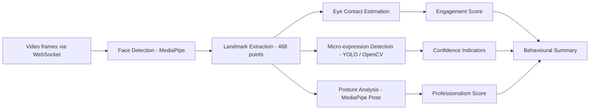

### 11.2 Metrics Computed

| Metric | Method | Interpretation |
|---|---|---|
| Eye contact ratio | Gaze vector vs camera axis | Engagement |
| Head pose stability | Euler angles over time | Composure |
| Smile / neutral ratio | Landmark-based expression | Confidence |
| Fidgeting detection | Body landmark velocity | Nervousness |
| Posture uprightness | Shoulder-ear alignment | Professionalism |

### 11.3 Key Functions

```typescript
// POST /ai/behaviour/analyse
interface BehaviourAnalysisRequest {
  session_id: string
  frame_sequence: VideoFrame[]  // sampled at 2 fps
}

interface VideoFrame {
  timestamp_ms: number
  frame_b64: string             // base64 JPEG, 320x240
}

interface BehaviourMetrics {
  eye_contact_ratio: float         // 0.0 – 1.0
  head_pose_stability: float       // 0.0 – 1.0
  expression_confidence: float     // 0.0 – 1.0
  posture_score: float             // 0.0 – 1.0
  fidgeting_score: float           // 0.0 – 1.0 (lower is better)
  overall_behavioural_score: float
}
```

### 11.4 Algorithm: Behavioural Scoring

```pascal
PROCEDURE compute_behavioural_score(frame_sequence)
  INPUT: frame_sequence (List of VideoFrame)
  OUTPUT: metrics (BehaviourMetrics)

  SEQUENCE
    eye_contacts    ← []
    pose_angles     ← []
    expressions     ← []
    velocities      ← []

    FOR each frame IN frame_sequence DO
      face_result  ← mediapipe_face.process(frame)

      IF face_result.landmarks IS NOT NULL THEN
        gaze   ← estimate_gaze(face_result.landmarks)
        pose   ← estimate_head_pose(face_result.landmarks)
        expr   ← classify_expression(face_result.landmarks)
        vel    ← compute_landmark_velocity(face_result.landmarks, previous_landmarks)

        eye_contacts.append(gaze.on_camera)
        pose_angles.append(pose.deviation_degrees)
        expressions.append(expr.confidence_score)
        velocities.append(vel.magnitude)
      END IF
    END FOR

    eye_contact_ratio    ← mean(eye_contacts)
    head_stability       ← 1.0 - clamp(mean(pose_angles) / 30.0, 0.0, 1.0)
    expr_confidence      ← mean(expressions)
    fidgeting            ← clamp(mean(velocities) / MAX_VELOCITY, 0.0, 1.0)
    posture              ← analyse_posture(frame_sequence)

    overall ← weighted_average([
      (eye_contact_ratio, 0.30),
      (head_stability,    0.20),
      (expr_confidence,   0.20),
      (posture,           0.20),
      (1.0 - fidgeting,   0.10)
    ])

    RETURN BehaviourMetrics { ... overall_behavioural_score = overall }
  END SEQUENCE
END PROCEDURE
```


---

## 12. Assessment and Scoring Architecture

### 12.1 Score Dimensions

Every completed interview session produces a multi-dimensional score. No dimension produces a composite rank or comparison against other students — all scoring is individual.

| Dimension | Source | Weight |
|---|---|---|
| Technical Knowledge | LLM answer evaluation | 30% |
| Communication | Speech quality + answer coherence | 20% |
| Behavioural / Non-verbal | Computer vision analysis | 20% |
| Coding Ability | Code execution + LLM review | 20% |
| Problem-Solving Process | Thinking aloud analysis | 10% |

### 12.2 Per-Turn Answer Evaluation

```typescript
// POST /ai/scoring/evaluate-answer
interface AnswerEvaluationRequest {
  session_id: string
  turn_number: number
  question: string
  transcript: string
  phase: InterviewPhase
  target_role: string
  expected_concepts: string[]    // from quantum plan
}

interface AnswerAnalysis {
  score: float                   // 0.0 – 1.0
  concept_coverage: float        // % expected concepts mentioned
  depth_score: float             // 0.0 – 1.0
  accuracy_score: float          // 0.0 – 1.0
  key_concepts_missed: string[]
  brief_feedback: string         // shown to student after turn
}
```

### 12.3 Algorithm: Final Score Aggregation

```pascal
PROCEDURE aggregate_session_scores(session_id, turn_analyses, coding_assessment,
                                    speech_metrics, behaviour_metrics)
  INPUT: all per-component scores
  OUTPUT: final_report (ReportScores)

  SEQUENCE
    // Technical score: mean of technical-phase turn scores
    tech_turns  ← filter(turn_analyses, phase = "technical")
    tech_score  ← mean(map(tech_turns, t => t.score)) IF len(tech_turns) > 0 ELSE 0.0

    // Communication score
    comm_score  ← weighted_average([
      (speech_metrics.clarity_score,  0.40),
      (speech_metrics.fluency_score,  0.30),
      (mean(map(turn_analyses, t => t.depth_score)), 0.30)
    ])

    // Behavioural score
    behav_score ← behaviour_metrics.overall_behavioural_score

    // Coding score
    code_score  ← coding_assessment.overall_coding_score IF coding_assessment EXISTS
                  ELSE null

    // Problem solving: HR + warmup turns
    ps_turns    ← filter(turn_analyses, phase IN ["warmup", "hr"])
    ps_score    ← mean(map(ps_turns, t => t.depth_score)) IF len(ps_turns) > 0 ELSE 0.0

    // Overall (exclude coding if not assessed)
    IF code_score IS NOT NULL THEN
      overall ← (0.30 * tech_score) + (0.20 * comm_score) + (0.20 * behav_score)
              + (0.20 * code_score)  + (0.10 * ps_score)
    ELSE
      overall ← (0.37 * tech_score) + (0.25 * comm_score) + (0.25 * behav_score)
              + (0.13 * ps_score)
    END IF

    RETURN ReportScores {
      overall_score        = overall,
      technical_score      = tech_score,
      communication_score  = comm_score,
      behavioural_score    = behav_score,
      coding_score         = code_score,
      problem_solving_score = ps_score
    }
  END SEQUENCE
END PROCEDURE
```


---

## 13. Report Generation Architecture

### 13.1 Report Components

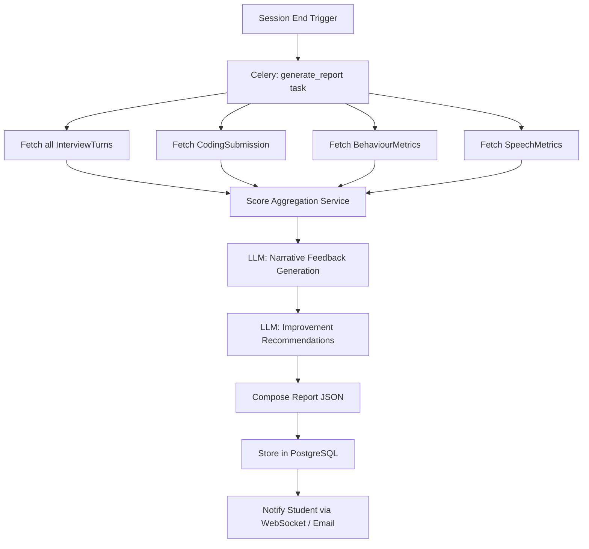

### 13.2 Report Structure

```typescript
interface StudentReport {
  report_id: string
  student_name: string
  session_date: string
  target_role: string
  session_duration_minutes: number

  scores: {
    overall: float
    technical: float
    communication: float
    behavioural: float
    coding: float | null
    problem_solving: float
  }

  strengths: string[]             // Top 3 areas with high scores
  improvement_areas: ImprovementArea[]

  turn_by_turn_breakdown: TurnBreakdown[]

  coding_summary?: {
    problem: string
    result: "passed" | "partial" | "failed"
    score: float
    llm_review: string
  }

  behavioural_summary: {
    eye_contact_rating: string    // "Good", "Needs Improvement"
    posture_rating: string
    confidence_rating: string
    key_observations: string[]
  }

  recommended_resources: Resource[]
  next_session_focus: string[]    // from quantum plan
}

interface ImprovementArea {
  area: string
  current_score: float
  target_score: float
  priority: "high" | "medium" | "low"
  recommendation: string
  resources: Resource[]
}
```

### 13.3 LLM Feedback Prompt for Report

```
System: You are an expert interview coach. Based on the following performance data,
        write a personalised, constructive, encouraging 3-paragraph feedback summary
        for the student. Focus on their individual performance only.
        Do NOT compare to other candidates.

Data:
  - Technical score: {tech_score}
  - Concepts missed: {missed_concepts}
  - Communication score: {comm_score}
  - Filler word ratio: {filler_ratio}
  - Coding: {coding_summary}
  - Behavioural: {behaviour_summary}

Write: (1) What they did well, (2) What to improve, (3) Specific action plan.
```


---

## 14. Quantum / QAOA Architecture

### 14.1 Purpose

Quantum computing is used to solve a combinatorial optimisation problem: given a student's resume skills, target role requirements, available preparation time, and current knowledge gaps, find the optimal sequence and weighting of interview topics that maximises preparation effectiveness.

This is modelled as a **Quadratic Unconstrained Binary Optimisation (QUBO)** problem and solved using the **Quantum Approximate Optimisation Algorithm (QAOA)** via Qiskit.

### 14.2 Problem Formulation

Let:
- `T = {t₁, t₂, ..., tₙ}` be the set of interview topics (e.g., Data Structures, Algorithms, System Design, OOP, SQL, etc.)
- `gᵢ` = gap score for topic `tᵢ` (1 − student's current proficiency in `tᵢ`)
- `rᵢ` = relevance of topic `tᵢ` to the target role (from a curated role-topic matrix)
- `wᵢ` = time weight (estimated time to reach proficiency)
- `T_budget` = total available preparation time

**Objective**: Select a binary assignment `xᵢ ∈ {0, 1}` for each topic indicating whether to prioritise it, maximising:

```
Maximise: Σᵢ (gᵢ × rᵢ × xᵢ) − penalty × max(0, Σᵢ(wᵢ × xᵢ) − T_budget)
```
 
This is encoded as a QUBO matrix `Q` where `Q_{ij}` captures pairwise interactions between topics and the budget penalty.

### 14.3 QAOA Pipeline

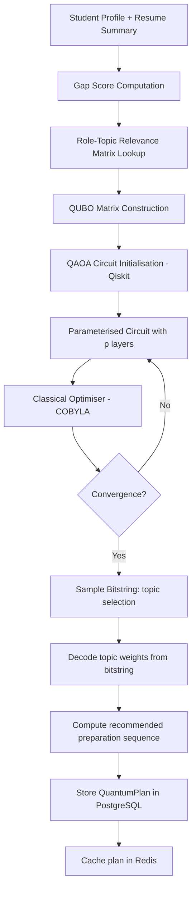

### 14.4 Key Functions

```typescript
// POST /ai/quantum/optimise
interface QuantumOptimisationRequest {
  student_id: string
  resume_summary: ResumeSummary
  target_role: string
  preparation_days: number          // T_budget proxy
}

interface QuantumPlan {
  plan_id: string
  student_id: string
  topic_weights: Record<string, float>   // topic → priority weight 0.0–1.0
  recommended_sequence: TopicBlock[]     // ordered study blocks
  qaoa_energy: float                     // final QAOA objective value
  circuit_depth: number                  // QAOA p-layers used
  generated_at: string
}

interface TopicBlock {
  topic: string
  day: number
  hours: float
  sub_topics: string[]
  practice_question_types: string[]
}
```

### 14.5 Algorithm: QUBO Construction

```pascal
PROCEDURE build_qubo_matrix(topics, gap_scores, relevance_scores, time_weights, budget)
  INPUT: topics (List<String>), gap_scores (Dict), relevance_scores (Dict),
         time_weights (Dict), budget (Float)
  OUTPUT: Q (n×n matrix)

  SEQUENCE
    n ← length(topics)
    Q ← zero_matrix(n, n)
    penalty ← 10.0  // Lagrange multiplier

    // Linear terms: diagonal — reward high-gap, high-relevance topics
    FOR i FROM 0 TO n-1 DO
      tᵢ    ← topics[i]
      Q[i,i] ← -(gap_scores[tᵢ] * relevance_scores[tᵢ])
    END FOR

    // Budget constraint penalty terms
    FOR i FROM 0 TO n-1 DO
      FOR j FROM i TO n-1 DO
        tᵢ ← topics[i]
        tⱼ ← topics[j]
        Q[i,j] ← Q[i,j] + penalty * time_weights[tᵢ] * time_weights[tⱼ]
      END FOR
      Q[i,i] ← Q[i,i] + penalty * (time_weights[topics[i]]^2 - 2 * budget * time_weights[topics[i]])
    END FOR

    RETURN Q
  END SEQUENCE
END PROCEDURE
```

### 14.6 Algorithm: QAOA Circuit (Conceptual)

```pascal
PROCEDURE run_qaoa(Q, p_layers, shots)
  INPUT: Q (QUBO matrix, n×n), p_layers (Int), shots (Int)
  OUTPUT: best_bitstring (List<0|1>), energy (Float)

  SEQUENCE
    n ← size(Q, 0)

    // Initialise Qiskit QuantumCircuit with n qubits
    circuit ← QuantumCircuit(n)

    // Apply Hadamard to all qubits (equal superposition)
    circuit.h(ALL)

    // QAOA layers: alternate cost and mixer unitaries
    FOR p FROM 1 TO p_layers DO
      // Cost unitary U_C(γ_p): encode QUBO objective
      FOR each (i, j) WHERE Q[i,j] ≠ 0 DO
        IF i = j THEN
          circuit.rz(2 * γ_p * Q[i,j], qubit_i)
        ELSE
          circuit.rzz(2 * γ_p * Q[i,j], qubit_i, qubit_j)
        END IF
      END FOR

      // Mixer unitary U_B(β_p): standard X-rotation mixer
      FOR each qubit i DO
        circuit.rx(2 * β_p, qubit_i)
      END FOR
    END FOR

    // Measure
    circuit.measure_all()

    // Classical optimisation loop (COBYLA minimises expected energy)
    optimal_params ← COBYLA.optimise(
      objective = lambda params: expected_energy(circuit, params, Q, shots),
      initial   = random_init(2 * p_layers)
    )

    // Sample with optimal parameters
    counts      ← execute(circuit, optimal_params, shots)
    best_bitstring ← argmin_energy(counts, Q)
    energy         ← compute_energy(best_bitstring, Q)

    RETURN best_bitstring, energy
  END SEQUENCE
END PROCEDURE
```

### 14.7 Practical Notes

- For production, p = 2 QAOA layers on a simulator (`qasm_simulator`) provides a good quality/speed tradeoff for n ≤ 20 topics.
- Qiskit Aer simulator is used (no quantum hardware required).
- A fallback classical greedy solver activates if QAOA exceeds 30-second timeout.
- The QAOA computation runs in a `ProcessPoolExecutor` worker in FastAPI to avoid blocking the event loop.


---

## 15. API Communication Architecture

### 15.1 URL Routing via Nginx

```nginx
# /api/* → Django (port 8000)
location /api/ {
    proxy_pass http://django:8000/;
}

# /ai/* → FastAPI (port 8001)
location /ai/ {
    proxy_pass http://fastapi:8001/;
}

# WebSocket upgrade for interview
location /ai/interview/ws/ {
    proxy_pass http://fastapi:8001/ai/interview/ws/;
    proxy_http_version 1.1;
    proxy_set_header Upgrade $http_upgrade;
    proxy_set_header Connection "upgrade";
}

# Frontend static files
location / {
    root /usr/share/nginx/html;
    try_files $uri /index.html;
}
```

### 15.2 Django → FastAPI Internal Communication

Django calls FastAPI synchronously (for session init and report generation) via `httpx` async client, or asynchronously via Celery tasks for background operations.

```typescript
// Django integration client (conceptual interface)
interface FastAPIClient {
  parseResume(resumeId: string, filePath: string): Promise<ResumeSummary>
  initSession(sessionId: string, studentContext: StudentContext): Promise<void>
  generateReport(sessionId: string): Promise<ReportData>
  runQuantumOptimise(request: QuantumOptimisationRequest): Promise<QuantumPlan>
}
```

### 15.3 Complete API Endpoint Catalogue

#### Django Endpoints (`/api/`)

| Method | Path | Description | Auth |
|---|---|---|---|
| POST | `/api/auth/register` | Student registration | Public |
| POST | `/api/auth/login` | JWT token pair | Public |
| POST | `/api/auth/refresh` | Refresh access token | Refresh token |
| GET | `/api/profile/me` | Get student profile | JWT |
| PATCH | `/api/profile/me` | Update profile | JWT |
| POST | `/api/resumes/upload` | Upload resume file | JWT |
| GET | `/api/resumes/` | List student resumes | JWT |
| GET | `/api/resumes/{id}` | Resume detail | JWT |
| POST | `/api/sessions/start` | Create interview session | JWT |
| GET | `/api/sessions/` | List sessions | JWT |
| GET | `/api/sessions/{id}` | Session detail | JWT |
| POST | `/api/sessions/{id}/end` | End session, trigger report | JWT |
| GET | `/api/reports/{id}` | Fetch report | JWT |
| GET | `/api/reports/` | List reports | JWT |
| GET | `/api/quantum/plan` | Get latest quantum plan | JWT |

#### FastAPI Endpoints (`/ai/`)

| Method | Path | Description | Auth |
|---|---|---|---|
| WS | `/ai/interview/ws/{session_id}` | Live interview WebSocket | JWT (query param) |
| POST | `/ai/resume/parse` | Parse resume | Internal |
| POST | `/ai/speech/transcribe` | Transcribe audio | JWT |
| POST | `/ai/behaviour/analyse` | Analyse video frames | JWT |
| POST | `/ai/code/submit` | Execute and evaluate code | JWT |
| POST | `/ai/scoring/evaluate-answer` | Score single answer | Internal |
| POST | `/ai/quantum/optimise` | Run QAOA optimisation | Internal |
| POST | `/ai/reports/generate` | Generate full report | Internal |
| GET | `/ai/health` | Health check | Public |

### 15.4 Data Flow: End-to-End Interview

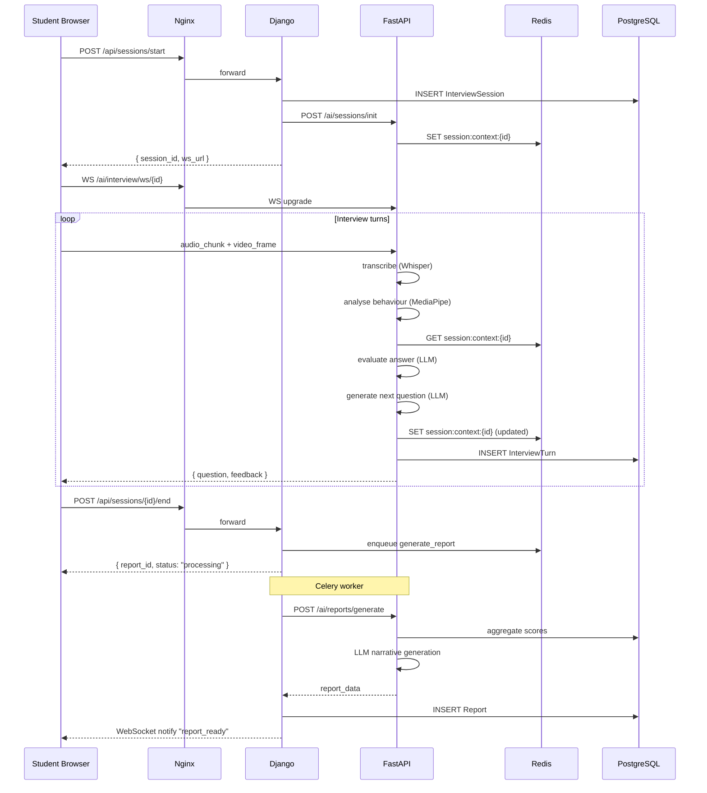


---

## 16. Authentication Architecture

### 16.1 Overview

Authentication is owned entirely by Django. FastAPI verifies JWT tokens but never issues them. This creates a single source of truth for identity.

### 16.2 Flow

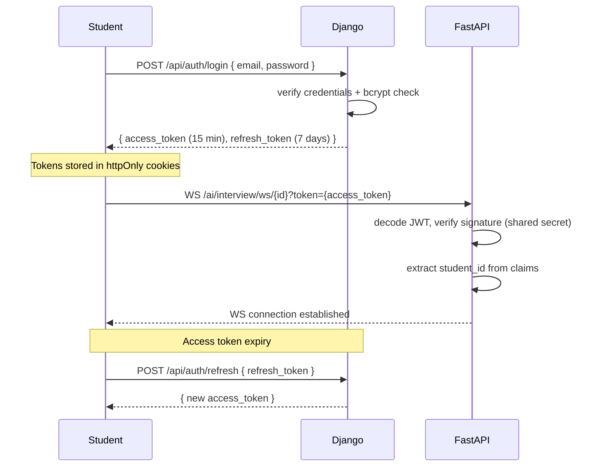

### 16.3 JWT Claim Structure

```typescript
interface JWTPayload {
  sub: string          // student_id (UUID)
  email: string
  role: "student" | "admin"
  iat: number          // issued at
  exp: number          // expiry
  jti: string          // JWT ID for revocation
}
```

### 16.4 FastAPI JWT Verification

FastAPI uses a shared `JWT_SECRET` environment variable (same as Django) to verify token signatures without contacting Django on every request. The verification is a local cryptographic check — no network call.

### 16.5 Security Measures

- Passwords: bcrypt with cost factor 12.
- JWT: RS256 or HS256 with secret rotation support.
- Tokens: `httpOnly` + `Secure` + `SameSite=Strict` cookies.
- CORS: Only the frontend origin is whitelisted.
- CSRF: Django's `csrftoken` for form-based endpoints.
- Rate limiting: Redis-backed per-IP and per-student limits.


---

## 17. Docker / Deployment Architecture

### 17.1 Service Containers

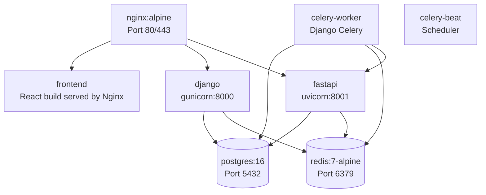

### 17.2 docker-compose.yml (Structural Overview)

```yaml
services:
  nginx:
    image: nginx:alpine
    ports: ["80:80", "443:443"]
    volumes: [nginx.conf, ssl_certs, frontend_build]
    depends_on: [frontend, django, fastapi]

  frontend:
    build: ./frontend
    # Vite build output copied to nginx static volume

  django:
    build: ./backend
    command: gunicorn config.wsgi:application --bind 0.0.0.0:8000 --workers 4
    env_file: .env
    depends_on: [postgres, redis]
    volumes: [media_files]

  celery-worker:
    build: ./backend
    command: celery -A config worker -l info -Q resume_queue,quantum_queue,report_queue,notification_queue
    env_file: .env
    depends_on: [redis, postgres, fastapi]

  celery-beat:
    build: ./backend
    command: celery -A config beat -l info --scheduler django_celery_beat.schedulers:DatabaseScheduler
    env_file: .env
    depends_on: [redis, postgres]

  fastapi:
    build: ./ai_service
    command: uvicorn main:app --host 0.0.0.0 --port 8001 --workers 2
    env_file: .env
    depends_on: [postgres, redis]
    deploy:
      resources:
        limits:
          memory: 8G       # AI models need memory

  postgres:
    image: postgres:16
    env_file: .env
    volumes: [pgdata:/var/lib/postgresql/data]

  redis:
    image: redis:7-alpine
    command: redis-server --maxmemory 1gb --maxmemory-policy allkeys-lru
    volumes: [redisdata:/data]

volumes:
  pgdata:
  redisdata:
  media_files:
```

### 17.3 Environment Variables

| Variable | Used By | Description |
|---|---|---|
| `DATABASE_URL` | Django, FastAPI | PostgreSQL DSN |
| `REDIS_URL` | Django, FastAPI | Redis connection string |
| `JWT_SECRET` | Django, FastAPI | Shared JWT signing secret |
| `LLM_API_KEY` | FastAPI | LLM provider API key |
| `LLM_MODEL` | FastAPI | Model name (e.g. gpt-4o) |
| `DJANGO_SECRET_KEY` | Django | Django secret |
| `ALLOWED_HOSTS` | Django | Comma-separated hosts |
| `CORS_ORIGIN` | Django, FastAPI | Frontend URL |
| `CODE_RUNNER_IMAGE` | FastAPI | Docker image for code execution |


---

## 18. Recommended Project Folder Structure

```
quantum-ai-interview-platform/
│
├── frontend/                          # React + TypeScript + Tailwind
│   ├── public/
│   ├── src/
│   │   ├── components/
│   │   │   ├── interview/
│   │   │   │   ├── VideoFeed.tsx
│   │   │   │   ├── AudioRecorder.tsx
│   │   │   │   ├── ChatPanel.tsx
│   │   │   │   ├── CodeEditor.tsx
│   │   │   │   └── SessionControls.tsx
│   │   │   ├── dashboard/
│   │   │   ├── profile/
│   │   │   ├── reports/
│   │   │   └── shared/
│   │   ├── pages/
│   │   │   ├── AuthPage.tsx
│   │   │   ├── DashboardPage.tsx
│   │   │   ├── InterviewPage.tsx
│   │   │   ├── PreparationPage.tsx
│   │   │   └── ReportPage.tsx
│   │   ├── hooks/
│   │   │   ├── useInterviewSocket.ts
│   │   │   ├── useMediaStream.ts
│   │   │   └── useCodeRunner.ts
│   │   ├── store/                     # Zustand stores
│   │   ├── api/                       # React Query hooks + axios clients
│   │   ├── types/                     # TypeScript interfaces
│   │   └── utils/
│   ├── tailwind.config.ts
│   ├── vite.config.ts
│   └── Dockerfile
│
├── backend/                           # Django
│   ├── config/
│   │   ├── settings/
│   │   │   ├── base.py
│   │   │   ├── development.py
│   │   │   └── production.py
│   │   ├── urls.py
│   │   └── celery.py
│   ├── apps/
│   │   ├── accounts/
│   │   │   ├── models.py
│   │   │   ├── serializers.py
│   │   │   ├── views.py
│   │   │   └── urls.py
│   │   ├── resumes/
│   │   ├── sessions/
│   │   ├── reports/
│   │   └── notifications/
│   ├── core/
│   │   ├── permissions.py
│   │   ├── pagination.py
│   │   └── exceptions.py
│   ├── tasks/
│   │   ├── resume_tasks.py
│   │   ├── quantum_tasks.py
│   │   ├── report_tasks.py
│   │   └── notification_tasks.py
│   ├── integrations/
│   │   └── fastapi_client.py
│   ├── requirements.txt
│   └── Dockerfile
│
├── ai_service/                        # FastAPI
│   ├── main.py
│   ├── routers/
│   │   ├── interview.py
│   │   ├── code_assessment.py
│   │   ├── speech.py
│   │   ├── behaviour.py
│   │   ├── resume.py
│   │   ├── quantum.py
│   │   ├── scoring.py
│   │   └── reports.py
│   ├── services/
│   │   ├── llm_service.py
│   │   ├── whisper_service.py
│   │   ├── nlp_service.py
│   │   ├── vision_service.py
│   │   ├── code_runner.py
│   │   ├── qaoa_service.py
│   │   └── scoring_service.py
│   ├── models/                        # Pydantic schemas
│   ├── core/
│   │   ├── redis_client.py
│   │   ├── db.py
│   │   └── security.py
│   ├── requirements.txt
│   └── Dockerfile
│
├── nginx/
│   ├── nginx.conf
│   └── Dockerfile
│
├── docker-compose.yml
├── docker-compose.prod.yml
├── .env.example
└── README.md
```


---

## 19. Major Technical Risks and Mitigations

| # | Risk | Severity | Likelihood | Mitigation |
|---|---|---|---|---|
| 1 | **LLM latency** — LLM calls add 1–5 seconds per question, degrading interview flow | High | High | Stream LLM responses token-by-token over WebSocket; pre-generate next question while student is answering |
| 2 | **WebSocket reliability** — connection drops mid-interview lose session state | High | Medium | All state stored in Redis; client reconnects and replays from last turn_number; heartbeat ping every 15s |
| 3 | **Code execution security** — arbitrary student code runs on server | Critical | High | Docker `--network none --memory 256m --cpus 1`; syscall whitelist via seccomp; 10s hard timeout; non-root user |
| 4 | **QAOA performance** — Qiskit simulator is CPU-heavy; n > 30 topics may time out | Medium | Medium | Limit to n ≤ 20 topics; p = 2 layers; ProcessPoolExecutor; 30s timeout with fallback to greedy solver |
| 5 | **Resume parsing accuracy** — OCR/NLP may misread skills from non-standard PDFs | Medium | High | Multi-step pipeline: pdfminer → LLM-assisted extraction; confidence scores; allow student to manually edit parsed skills |
| 6 | **Video/audio browser permissions** — students may deny camera/mic access | Medium | Medium | Graceful degradation: interview continues text-only; behavioural score excluded from overall if no video |
| 7 | **Model cold start** — Whisper and vision models take 20–60s to load | Medium | High | Preload models at FastAPI startup (lifespan event); health check waits for readiness before accepting traffic |
| 8 | **Data privacy** — video frames and audio contain biometric data | High | Certain | Video frames processed in memory only (not persisted); audio deleted after transcription; GDPR-style consent flow |
| 9 | **Django ↔ FastAPI coupling** — if FastAPI is down, session start fails | Medium | Low | Circuit breaker pattern in Django's httpx client; sessions degrade gracefully (no AI features, raw text interview) |
| 10 | **PostgreSQL under concurrent sessions** — many active sessions = many writes | Medium | Medium | Connection pooling via pgBouncer; InterviewTurn inserts use bulk_create; async SQLAlchemy in FastAPI |

---

## 20. Development Phases

### Phase 1 — Foundation (Weeks 1–3)
- Docker Compose setup (all services running)
- Django: User auth, student profile, resume upload (models + APIs)
- FastAPI: Health check, basic JWT verification, project scaffold
- Frontend: Auth pages, dashboard shell, routing
- PostgreSQL schema migrations
- Redis connectivity

**Milestone**: Student can register, log in, upload a resume, and see their dashboard.

### Phase 2 — Resume Intelligence (Weeks 4–5)
- Resume text extraction pipeline (pdfminer/python-docx)
- NLP skill extraction (spaCy NER + skill ontology)
- LLM-assisted project summarisation
- Django Celery resume parsing task
- Resume detail page on frontend

**Milestone**: Student uploads resume → skills/projects auto-extracted and displayed.

### Phase 3 — Quantum Preparation Plan (Weeks 6–7)
- Role-topic relevance matrix (curated data)
- QUBO matrix construction
- QAOA circuit implementation with Qiskit Aer
- Fallback greedy solver
- Preparation Hub frontend (topic roadmap visualisation)

**Milestone**: QAOA generates a personalised study plan after resume upload.

### Phase 4 — AI Interviewer Core (Weeks 8–10)
- WebSocket session management (FastAPI)
- LLM question generation and answer evaluation
- Session context in Redis
- Interview phase state machine
- Basic interview UI (chat panel, audio recording, session controls)

**Milestone**: Student can conduct a basic text + audio AI interview end-to-end.

### Phase 5 — Coding Assessment (Weeks 11–12)
- Monaco Editor integration
- Code problem bank
- Docker-based code runner
- Code assessment scoring
- Coding phase in interview flow

**Milestone**: Coding problems presented mid-interview; code is executed and evaluated.

### Phase 6 — Speech & Behavioural Analysis (Weeks 13–15)
- Whisper transcription integration
- Speech quality metrics (WPM, filler words, clarity)
- MediaPipe face + pose landmark extraction
- Behavioural scoring algorithm
- Video feed component on frontend

**Milestone**: Audio transcription and video analysis run during live interview.

### Phase 7 — Scoring & Reports (Weeks 16–17)
- Multi-dimensional score aggregation
- LLM narrative feedback generation
- Report generation pipeline (Celery async)
- Report viewer on frontend (charts, per-turn breakdown)
- Improvement recommendations with resources

**Milestone**: Complete post-interview report generated and viewable within 2 minutes of session end.

### Phase 8 — Polish, Testing & Deployment (Weeks 18–20)
- End-to-end integration testing
- Performance optimisation (LLM streaming, Redis caching)
- Security hardening (rate limiting, input validation, CORS)
- Production Docker Compose + Nginx SSL
- Load testing
- Documentation

**Milestone**: Production-ready platform deployed.

---

## 21. Correctness Properties

The following properties hold for any valid platform state:

1. **Individual isolation**: For any two distinct students `A` and `B`, `A`'s report score is computed solely from `A`'s session data and never references `B`'s data.

2. **Score boundedness**: For any dimension score `s`, `0.0 ≤ s ≤ 1.0`.

3. **Turn consistency**: For any session, `turn_history[i].turn_number = i + 1` for all `i` from `0` to `len(turn_history) - 1`.

4. **Phase monotonicity**: In any session, the sequence of phases follows `Warmup → Technical → (Coding?) → HR → Closing` with no phase visited twice.

5. **QAOA budget adherence**: For any generated quantum plan, `Σ topic_blocks[i].hours ≤ preparation_days × 8`.

6. **Code execution isolation**: No code submitted by student `A` can read, modify, or affect state accessible to student `B`'s session.

7. **Report completeness**: A report is generated if and only if its corresponding session has status `"completed"`.

8. **Session context atomicity**: Concurrent WebSocket messages on the same session produce serialised, non-corrupted context updates (enforced by Redis WATCH/MULTI/EXEC).

---

## 22. Testing Strategy

### Unit Testing
- Django: pytest-django for model, serialiser, and view unit tests.
- FastAPI: pytest + httpx AsyncClient for all routers.
- Scoring algorithms: parameterised tests with known inputs and expected score ranges.

### Property-Based Testing
- Hypothesis (Python) for QUBO construction: verify `Q` is symmetric and budget constraint penalties are always positive.
- Hypothesis for score aggregation: verify output is always in `[0.0, 1.0]` for any combination of sub-scores.

### Integration Testing
- Docker Compose test environment with test fixtures.
- Full session flow test: register → upload resume → start session → complete turns → end session → verify report.

### Performance Testing
- Locust for API load testing: 50 concurrent students, each running an interview session.
- WebSocket stress test: 100 concurrent WebSocket connections.

